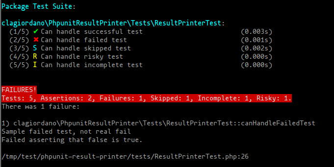

# PHPUnit result printer

PHPUnit result printer is a custom phpunit result printer with pretty output and timings

Sample image:



## Getting Started

These instructions will get you a copy of the project up and running on your local machine for development and testing purposes.

### Prerequisites

What things you need to install the software and how to install them

- php >= 5.4
- composer

### Installing

The recommended way to install phpunit-result-printer is through [Composer](https://getcomposer.org).

```bash
composer require clagiordano/phpunit-result-printer
```

After install you can edit your phpunit.xml as follow:

```
<phpunit
    ...
    printerClass="clagiordano\PhpunitResultPrinter\ResultPrinter"
>
...
</phpunit>
```

A full phpunit.xml example:

```xml
<?xml version="1.0" encoding="UTF-8"?>
<phpunit backupGlobals="false"
         backupStaticAttributes="false"
         bootstrap="vendor/autoload.php"
         colors="true"
         convertErrorsToExceptions="true"
         convertNoticesToExceptions="true"
         convertWarningsToExceptions="true"
         processIsolation="false"
         stopOnFailure="false"
         verbose="true"
         printerClass="clagiordano\PhpunitResultPrinter\ResultPrinter"
        >
    <testsuites>
        <testsuite name="Package Test Suite">
            <directory suffix=".php">./tests/</directory>
        </testsuite>
    </testsuites>
</phpunit>
```

## Running the tests

You can clone and test this project with the following commands:

```bash
git clone https://github.com/clagiordano/phpunit-result-printer.git
cd phpunit-result-printer
composer install
./vendor/bin/phpunit
```

One of the previous tests fails for demo purpose


## Contributing

Please read [CONTRIBUTING.md](https://gist.github.com/PurpleBooth/b24679402957c63ec426) for details on our code of conduct, and the process for submitting pull requests to us.

## Versioning

We use [SemVer](http://semver.org/) for versioning. For the versions available, see the [tags on this repository](https://github.com/your/project/tags). 

## Authors

* **Claudio Giordano** - *Initial work* - [clagiordano](https://github.com/clagiordano)

See also the list of [contributors](CONTRIBUTORS.md) who participated in this project.

## License

This project is licensed under the MIT License - see the [LICENSE.md](LICENSE.md) file for details
